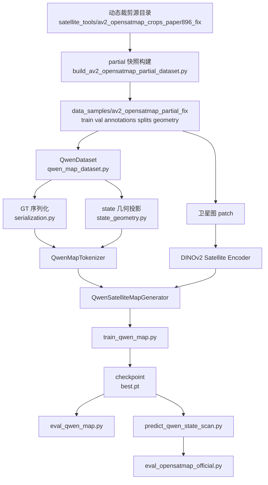
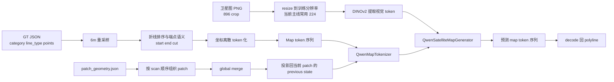
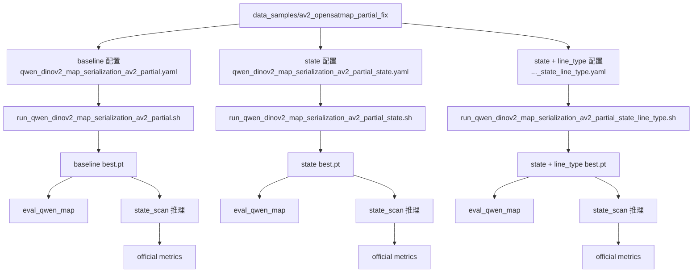
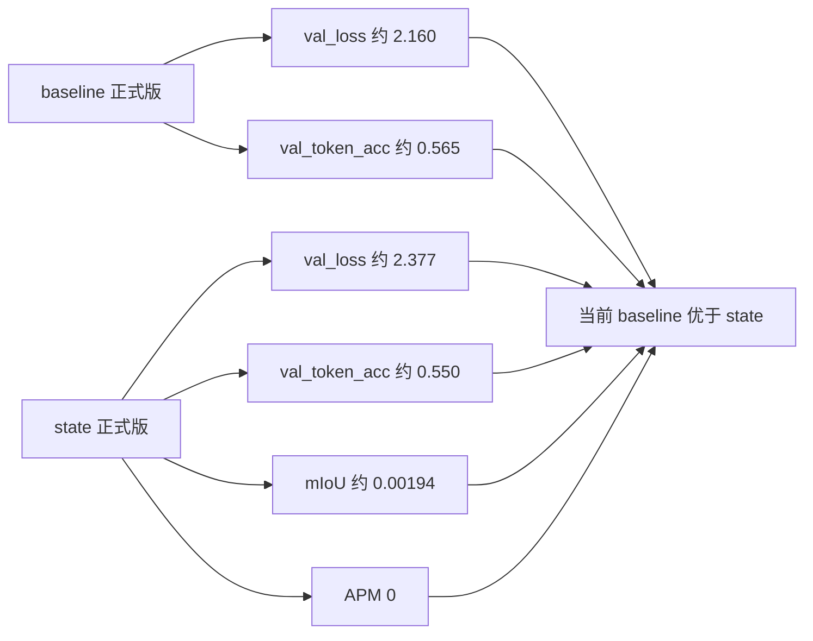

# UniMapGen 当前模型流程图（2026-03-08）

这份文档把当前已经实际跑通的复现主线画成流程图，方便快速理解：

- 数据是怎么进入模型的
- `baseline` 和 `state` 两条训练/评估链怎么闭环
- 当前已经完成了什么
- 离“完全复现论文”还差什么

## 1. 当前主线总览

## 2. 数据与模型细化

## 3. baseline 与 state 两条实验链

## 4. 当前复现状态图

```mermaid
flowchart TD
    A[已完成的复现工作]

    A --> B1[partial 快照数据集]
    A --> B2[baseline 正式训练]
    A --> B3[baseline 正式评估闭环]
    A --> B4[state 正式训练]
    A --> B5[state 正式评估闭环]
    A --> B6[line_type 接入]
    A --> B7[official metrics 接入]
    A --> B8[paper-style augmentation 脚手架]
    A --> B9[缓存与日志等工程优化]

    C[当前结论]
    C --> C1[工程链路已经跑通]
    C --> C2[baseline 已经学起来]
    C --> C3[state 当前版本弱于 baseline]
    C --> C4[official metrics 也支持同样结论]

    D[未完成的论文对齐工作]
    D --> D1[full paper-scale augmentation]
    D --> D2[更 paper-aligned 的 cut_points state]
    D --> D3[更高分辨率坐标量化 tokenizer]
    D --> D4[stage1 到 stage3 正式训练链]
    D --> D5[PV 分支接入当前 Qwen 主线]
    D --> D6[完整数据上的最终论文指标表]
```

## 5. 当前最重要的实验结论

## 6. 建议如何用这张图

如果你现在要继续推进复现，建议按下面顺序读图：

1. 先看“当前主线总览”，确认训练和评估闭环已经打通。
2. 再看“baseline 与 state 两条实验链”，明确当前对比是怎么做的。
3. 最后看“当前复现状态图”，判断下一步应该补哪一块论文缺口。

相关交接文档：

- [agent_handoff_20260307.md](/mnt/data/project/jn/UniMapGen/docs/agent_handoff_20260307.md)
- [agent_handoff_update_20260308.md](/mnt/data/project/jn/UniMapGen/docs/agent_handoff_update_20260308.md)
- [paper_aligned_model_flowchart_20260308.md](/mnt/data/project/jn/UniMapGen/docs/paper_aligned_model_flowchart_20260308.md)
- [serialization_and_state_update_flow_20260308.md](/mnt/data/project/jn/UniMapGen/docs/serialization_and_state_update_flow_20260308.md)
- [finetune_dataset_and_prompt_flow_20260308.md](/mnt/data/project/jn/UniMapGen/docs/finetune_dataset_and_prompt_flow_20260308.md)
- [model_architecture_intro_20260308.md](/mnt/data/project/jn/UniMapGen/docs/model_architecture_intro_20260308.md)
