# 当前微调数据集与 Prompt 流程图（2026-03-08）

这份图只回答一个问题：

`当前训练时，模型到底看到了什么数据、什么 prompt、什么 target。`

对应代码和配置：

- [qwen_map_dataset.py](/mnt/data/project/jn/UniMapGen/unimapgen/data/qwen_map_dataset.py)
- [qwen_map_tokenizer.py](/mnt/data/project/jn/UniMapGen/unimapgen/data/qwen_map_tokenizer.py)
- [qwen_dinov2_map_serialization_av2_partial.yaml](/mnt/data/project/jn/UniMapGen/configs/qwen_dinov2_map_serialization_av2_partial.yaml)
- [qwen_dinov2_map_serialization_av2_partial_state.yaml](/mnt/data/project/jn/UniMapGen/configs/qwen_dinov2_map_serialization_av2_partial_state.yaml)

## 1. 当前单样本总流程

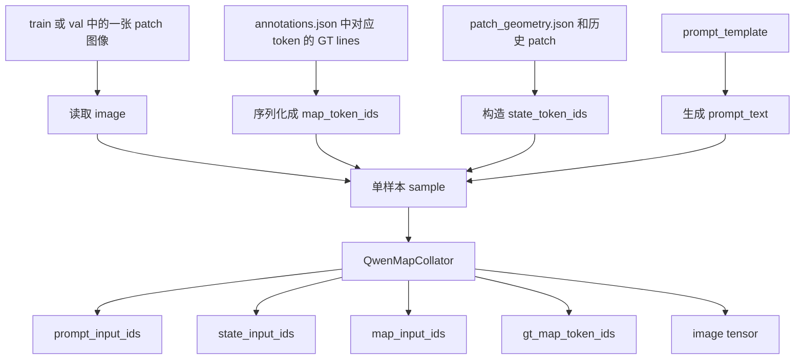

## 2. 当前 sample 的字段长什么样

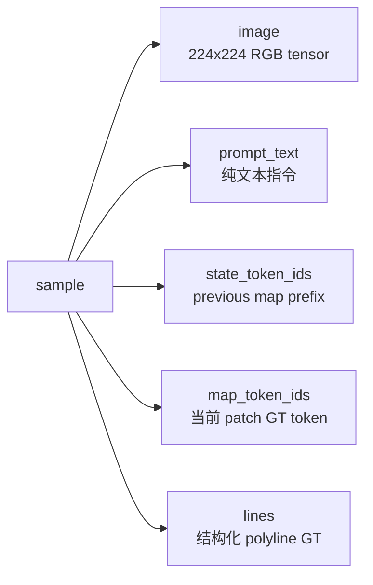

当前 dataset 返回的就是这五类核心信息。

## 3. baseline 数据样本怎么构成

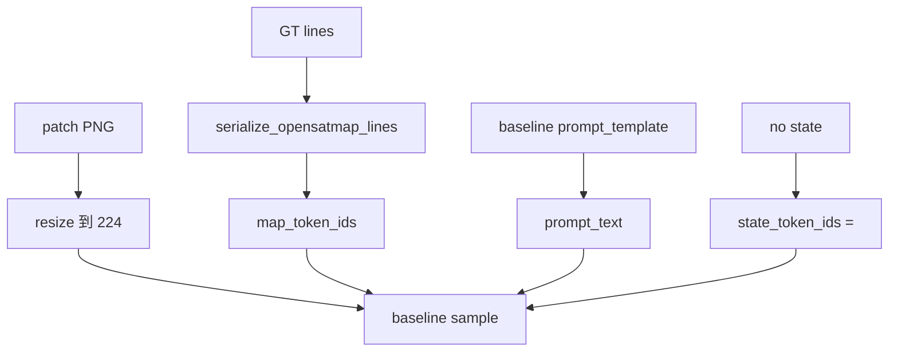

baseline 的核心特点：

- 有卫星图
- 有文字任务指令
- 没有真实 previous state
- `state_token_ids` 只有一个 `<state>`

## 4. state 数据样本怎么构成

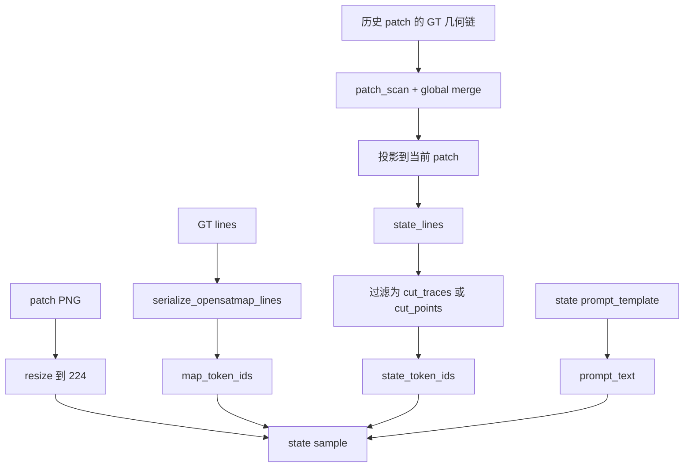

state 的核心特点：

- 当前 patch 的 target 仍然是当前 GT
- 但输入里多了 previous map state prefix
- 这个 prefix 不是拍脑袋拼的，而是由历史 patch GT 通过几何投影得到

## 5. baseline prompt 现在是什么

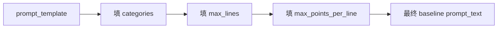

当前 baseline 配置里的 prompt 语义是：

```text
You are given a satellite image embedding.
Generate the serialized vector map using only reserved map tokens.
Represent curb, lane line, virtual line.
Output at most 48 polylines and at most 24 points per polyline.
```

## 6. state prompt 现在是什么

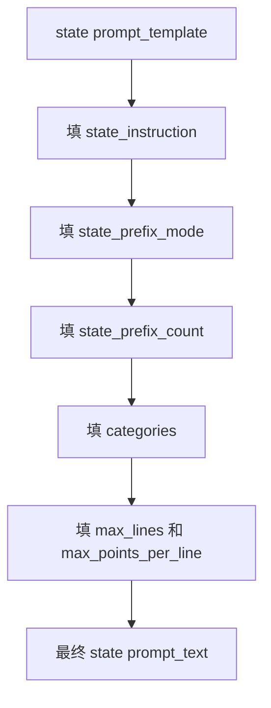

其中 `state_instruction` 是动态变化的：

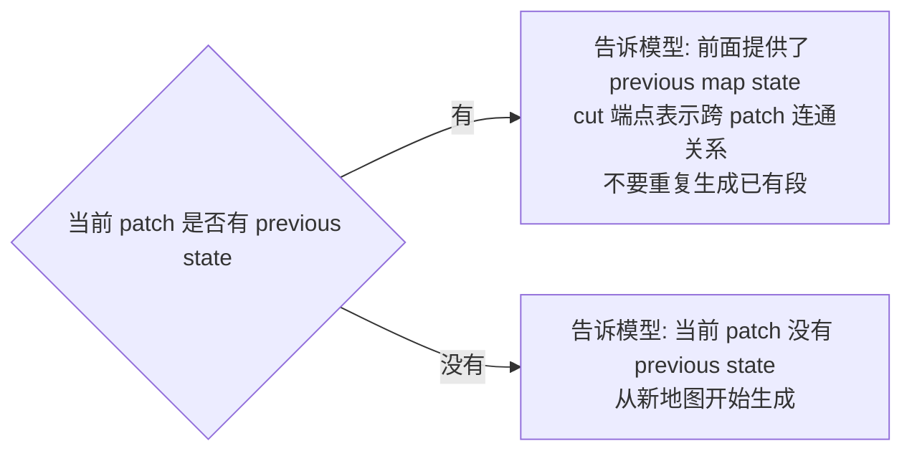

当前正式 state 配置还会额外显式告诉模型：

- `state_prefix_mode = cut_traces`
- `state_prefix_count = 当前 prefix primitive 数量`

## 7. line_type 版 prompt 的额外内容

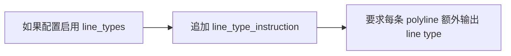

追加的语义大致是：

```text
For each polyline, also output its line type using one of:
solid, thick solid, dashed, short dashed, others.
```

## 8. prompt 和 map token 如何进入 Qwen tokenizer

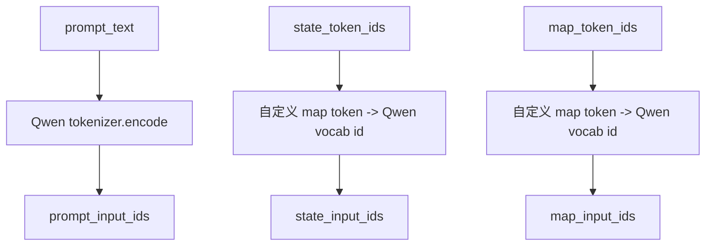

这里要注意：

- `prompt_text` 走的是普通 Qwen 文本 tokenizer
- `state_token_ids` 和 `map_token_ids` 先是自定义 map token，再映射到 Qwen 扩展词表

## 9. collator 最终打包成什么

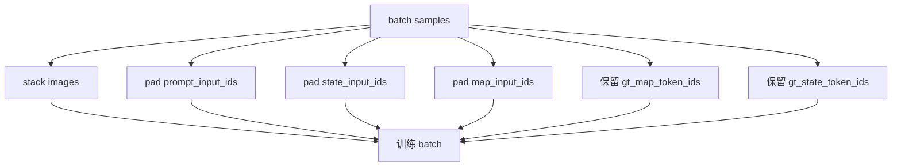

最终 batch 里最关键的字段是：

- `image`
- `prompt_input_ids`
- `prompt_attention_mask`
- `state_input_ids`
- `state_attention_mask`
- `map_input_ids`
- `map_attention_mask`
- `gt_map_token_ids`

## 10. 当前微调任务可以怎么理解

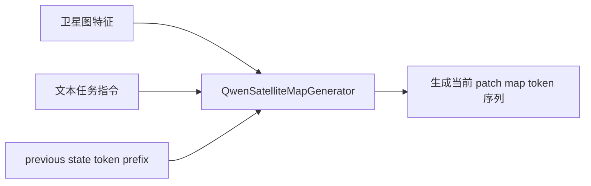

也就是说，当前并不是纯图像到地图，也不是纯语言到地图，而是：

`视觉条件 + 文本指令 + 可选 previous state -> 当前 patch 序列化地图`

## 11. 当前这套 prompt / 数据集的现实特点

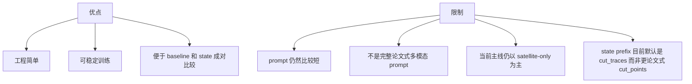

## 12. 一句话总结

当前微调样本本质上就是：

`一张卫星图 + 一段任务指令 + 一个 previous map state 前缀 + 当前 patch 的地图 token 监督`

相关文档：

- [serialization_and_state_update_flow_20260308.md](/mnt/data/project/jn/UniMapGen/docs/serialization_and_state_update_flow_20260308.md)
- [current_model_flowchart_20260308.md](/mnt/data/project/jn/UniMapGen/docs/current_model_flowchart_20260308.md)
- [paper_aligned_model_flowchart_20260308.md](/mnt/data/project/jn/UniMapGen/docs/paper_aligned_model_flowchart_20260308.md)
