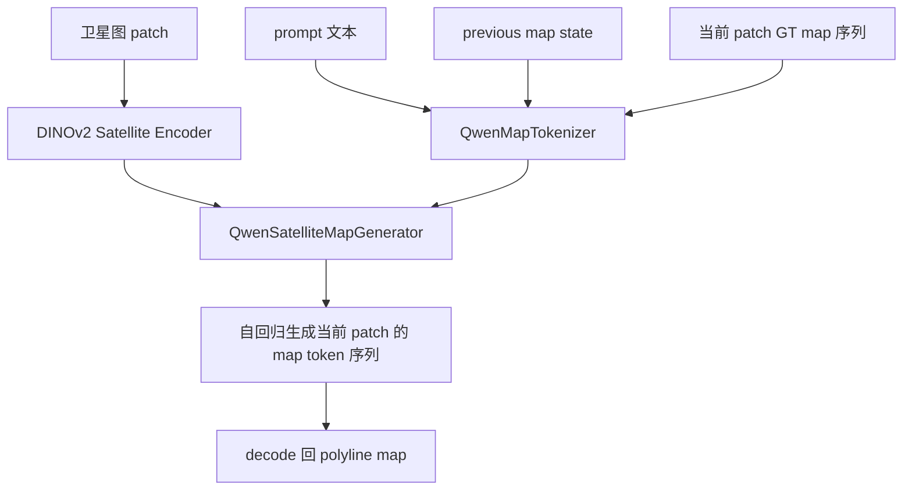
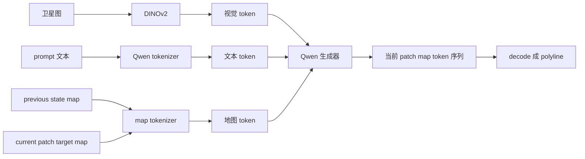

# UniMapGen 当前模型介绍（仅模型层面，2026-03-08）

这份文档只介绍当前 UniMapGen 复现主线里的模型本身，不展开具体配置、训练脚本、评估结果和实验结论。

目标是让读者快速理解：

- 模型输入是什么
- 中间表示是什么
- 各模块分别做什么
- 序列化和 state update 在模型里扮演什么角色

## 1. 模型一句话概括

当前主线模型可以概括为：

`DINOv2 编码卫星图 + Qwen 自回归生成地图序列 + 可选 previous-state prefix`

也就是一个“视觉条件下的地图序列生成模型”。

## 2. 模型总结构



## 3. 输入与输出

### 3.1 输入

当前模型从结构上接收三类条件：

1. 卫星图像
- 一张 patch 级卫星图
- 由视觉编码器转成视觉 token

2. 文本 prompt
- 一段任务说明
- 告诉模型要输出地图序列、类别范围和约束

3. previous map state
- 可选输入
- 表示历史 patch 已经形成的局部地图状态
- 用 token 前缀形式喂给模型

### 3.2 输出

模型输出不是 mask，也不是 BEV feature map，而是：

- 当前 patch 的地图 token 序列

这些 token 最终会被 decode 成：

- 多条 polyline
- 每条 polyline 带类别、可选线型、端点属性和点坐标

## 4. 视觉分支

视觉分支的核心是：

- [satellite_encoder.py](/mnt/data/project/jn/UniMapGen/unimapgen/models/encoders/satellite_encoder.py)

当前主线使用 DINOv2 作为卫星图编码器。

它的职责是：

1. 读取卫星 patch 图像
2. 做必要归一化
3. 提取视觉 token
4. 把视觉 token 送给后面的 Qwen 地图生成器

所以从模型视角看，卫星图不直接被当成像素去预测地图，而是先经过一个通用视觉 backbone 编码成更紧凑的视觉表示。

## 5. 地图序列表示

地图不是直接表示成 raster，而是表示成序列。

当前序列化核心文件是：

- [serialization.py](/mnt/data/project/jn/UniMapGen/unimapgen/data/serialization.py)

一条 polyline 在序列里大致长这样：

```text
<line> <cat_xxx> [<lt_xxx>] <s_start/cut> <e_end/cut> <pts> <x_i> <y_j> ... <eol>
```

多条线再拼成完整样本：

```text
<bos> ... 多条 polyline ... <eos>
```

这种表示的关键点是：

1. 线是按序列生成的
2. 每条线显式带有类别
3. 首尾端点显式带有 `start / end / cut`
4. 坐标被离散成 token
5. 可选再加入 `line_type`

## 6. 为什么要有 `start/end/cut`

`start/end/cut` 是当前模型里非常重要的结构信息。

含义是：

- `start` / `end`：普通线段端点
- `cut`：表示该线在当前 patch 边界处被截断，可能需要和相邻 patch 连上

这使模型不仅是在“生成一堆局部线段”，而是在为跨 patch 连续地图提供结构线索。

## 7. Tokenizer 的作用

相关文件：

- [qwen_map_tokenizer.py](/mnt/data/project/jn/UniMapGen/unimapgen/data/qwen_map_tokenizer.py)

这里实际上有两层 tokenizer：

1. 地图 tokenizer
- 负责把 polyline map 转成自定义 map token
- 也负责把生成结果 decode 回结构化线段

2. Qwen tokenizer 包装层
- 把自定义 map token 注册到 Qwen 词表中
- 把 prompt 文本和 map token 都统一映射到 Qwen 可处理的 token id 空间

所以当前模型不是在两套完全分离的 token 系统里工作，而是把地图 token 扩展进了 Qwen 的词表体系。

## 8. 生成器主体

核心模型文件：

- [qwen_map_generator.py](/mnt/data/project/jn/UniMapGen/unimapgen/models/qwen_map_generator.py)

它本质上是一个：

- 以 Qwen 语言模型为核心的自回归生成器

但和普通纯文本生成不同，它多了两个重要条件：

1. 卫星图视觉 token
2. previous map state token prefix

因此可以把它理解成：

- 一个“条件语言模型”
- 条件来自视觉和地图状态
- 输出目标是地图序列而不是自然语言

## 9. 当前模型里的 previous state 是什么

previous state 不是单独的 memory tensor，而是：

- 一段序列化后的地图 token 前缀

来源逻辑在：

- [qwen_map_dataset.py](/mnt/data/project/jn/UniMapGen/unimapgen/data/qwen_map_dataset.py)
- [state_geometry.py](/mnt/data/project/jn/UniMapGen/unimapgen/state_geometry.py)

它表示的是：

- 当前 patch 之前已经构建出的局部历史地图
- 再把这部分历史投影到当前 patch 坐标系里
- 最后编码成 token，放在当前地图 token 之前

所以 current patch 的生成，不是完全从零开始，而是在“已有局部地图状态”的条件下继续往前生成。

## 10. State Update 的模型意义

从模型角度看，state update 的作用不是改 backbone，而是改输入条件。

也就是说：

- baseline：`卫星图 + prompt -> 当前 patch map`
- state：`卫星图 + prompt + previous state -> 当前 patch map`

所以 state update 更像是：

- 对生成任务加入结构化历史条件
- 让模型有机会学习跨 patch 连续性

## 11. 当前 state prefix 的几种形式

当前代码里 state prefix 可以有几种抽取方式：

- `all`
- `cut_only`
- `cut_traces`
- `cut_points`

从模型意义上看，它们的差别是：

1. `all`
- 把更多历史线段都作为上下文

2. `cut_only`
- 只保留和 patch 边界连通最相关的历史线

3. `cut_traces`
- 只保留 cut 端点附近的一小段轨迹

4. `cut_points`
- 只保留 cut 端点本身

它们本质上是在控制：

- 历史地图状态以多详细的形式进入当前生成器

## 12. 当前模型的核心信息流



## 13. 当前模型和论文目标的关系

当前这条模型主线，已经对上了论文里的几个关键思想：

- 卫星图编码器
- 地图序列化表示
- 自回归地图生成
- previous state 条件输入
- 连续地图构建方向

但从纯模型层面看，离论文完整版还没有完全一致，主要还差：

- 更完整的多模态输入，尤其是 PV 分支
- 更论文化的 state prefix 设计
- 更高分辨率的坐标量化
- 更完整的阶段化训练路径

## 14. 当前模型最该怎么理解

最准确的理解方式不是“一个普通地图分割模型”，而是：

- 一个基于卫星图条件的地图语言模型

它做的事情是：

1. 先把地图转成 token 序列
2. 再把视觉信息和历史地图状态一起送进 Qwen
3. 最后让 Qwen 像生成句子一样生成当前 patch 的地图

## 15. 相关文件

如果只看模型核心，优先读这些文件：

- [satellite_encoder.py](/mnt/data/project/jn/UniMapGen/unimapgen/models/encoders/satellite_encoder.py)
- [serialization.py](/mnt/data/project/jn/UniMapGen/unimapgen/data/serialization.py)
- [qwen_map_tokenizer.py](/mnt/data/project/jn/UniMapGen/unimapgen/data/qwen_map_tokenizer.py)
- [qwen_map_dataset.py](/mnt/data/project/jn/UniMapGen/unimapgen/data/qwen_map_dataset.py)
- [state_geometry.py](/mnt/data/project/jn/UniMapGen/unimapgen/state_geometry.py)
- [qwen_map_generator.py](/mnt/data/project/jn/UniMapGen/unimapgen/models/qwen_map_generator.py)
- [qwen_map_pipeline.py](/mnt/data/project/jn/UniMapGen/unimapgen/qwen_map_pipeline.py)

相关补充图：

- [current_model_flowchart_20260308.md](/mnt/data/project/jn/UniMapGen/docs/current_model_flowchart_20260308.md)
- [serialization_and_state_update_flow_20260308.md](/mnt/data/project/jn/UniMapGen/docs/serialization_and_state_update_flow_20260308.md)
- [finetune_dataset_and_prompt_flow_20260308.md](/mnt/data/project/jn/UniMapGen/docs/finetune_dataset_and_prompt_flow_20260308.md)
