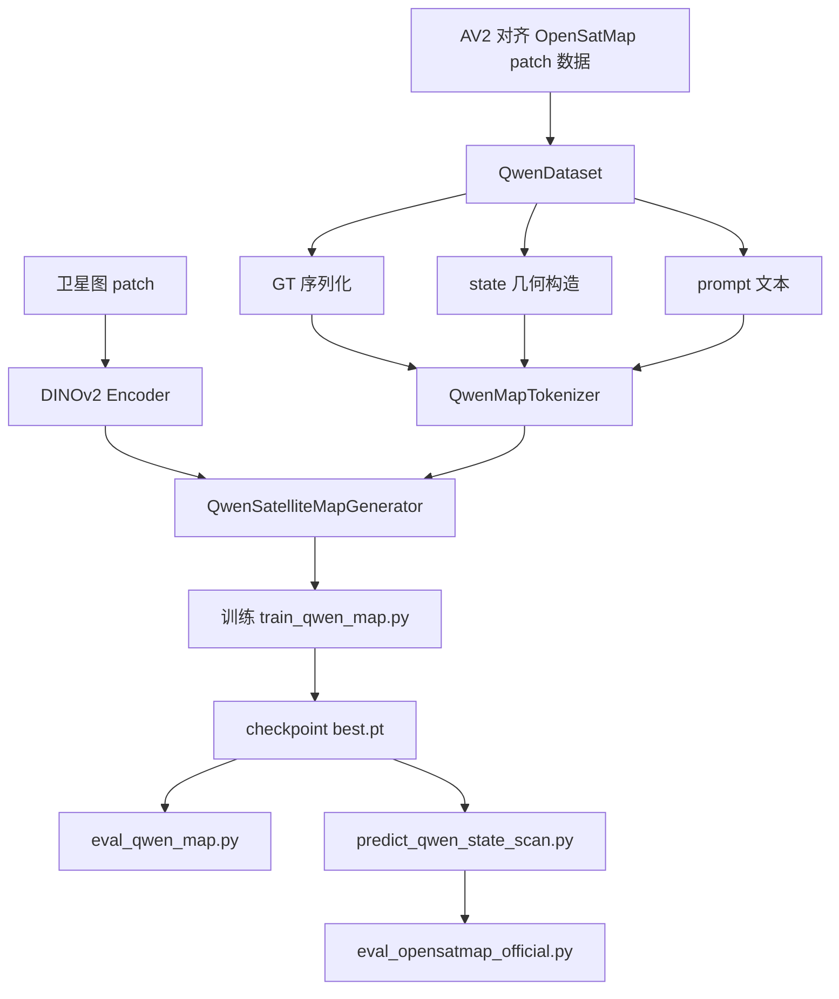
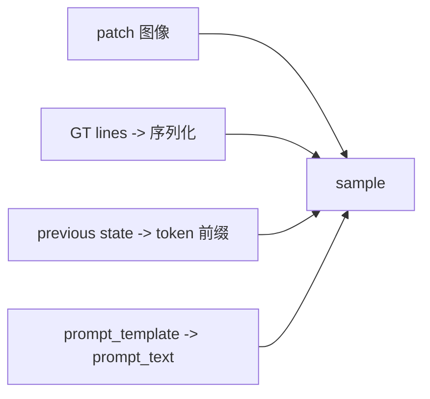

# UniMapGen 当前模型统一说明（2026-03-08）

这份文档是当前 UniMapGen 复现主线的统一说明，面向第一次接手项目的人。

它把原本分散在多份 handoff、流程图、配置和脚本里的信息收拢到一处，回答下面这些问题：

- 现在这个模型到底在做什么
- 输入、输出、训练样本分别是什么
- 序列化和 state update 是怎么实现的
- 当前跑过哪些实验，结论是什么
- 离论文完全复现还差什么

## 1. 一句话概括

当前最成熟、已经真正跑通训练和评估闭环的主线是：

`DINOv2 卫星图编码 + Qwen2.5-1.5B 自回归地图序列生成 + map serialization + geometry-aware state update`

它当前主要做的是：

- 输入一张卫星 patch
- 可选再输入一段 previous map state prefix
- 输出当前 patch 的矢量地图 token 序列
- 再把 token decode 回 polyline map

## 2. 当前主线长什么样



## 3. 当前模型的目标与输入输出

### 3.1 目标

给定一个地图 patch，生成当前 patch 的矢量地图序列。

在 `state` 模式下，目标不是单 patch 独立生成，而是：

- 利用前面 patch 已形成的历史地图状态
- 预测当前 patch
- 再把当前 patch 并回全局图

### 3.2 输入

当前稳定主线的输入有三部分：

1. `image`
- 一张卫星 patch 图像
- 当前常用训练尺寸是 `224x224`
- 原始来源是 `896x896` crop

2. `prompt_text`
- 一段简短的自然语言任务指令
- 说明要输出地图序列、类别范围、最大线数和点数

3. `state_token_ids`
- previous map state 的 token 前缀
- baseline 中基本只有一个 `<state>`
- state 模式中来自真实几何历史投影

### 3.3 输出

模型输出的是当前 patch 的 map token 序列。

结构上大致是：

- `<bos>`
- 多条 polyline
  - `<line>`
  - `<cat_xxx>`
  - 可选 `<lt_xxx>`
  - `<s_start/cut>`
  - `<e_end/cut>`
  - `<pts>`
  - `<x_i> <y_j> ...`
  - `<eol>`
- `<eos>`

## 4. 当前数据集是什么

当前正式实验主用的数据快照目录是：

- [av2_opensatmap_partial_fix](/mnt/data/project/jn/UniMapGen/data_samples/av2_opensatmap_partial_fix)

里面包含：

- [annotations.json](/mnt/data/project/jn/UniMapGen/data_samples/av2_opensatmap_partial_fix/annotations.json)
- [splits_meta.json](/mnt/data/project/jn/UniMapGen/data_samples/av2_opensatmap_partial_fix/splits_meta.json)
- [patch_geometry.json](/mnt/data/project/jn/UniMapGen/data_samples/av2_opensatmap_partial_fix/patch_geometry.json)
- `train/`
- `val/`

数据来源是：

- 动态裁剪源目录 `/mnt/data/project/jn/satellite_tools/av2_opensatmap_crops_paper896_fix`

但训练和评估不直接读动态目录，而是读构建好的快照目录，避免裁剪过程中的样本数量变化污染实验。

## 5. 当前一个训练样本长什么样

dataset 最终返回的核心字段在 [qwen_map_dataset.py](/mnt/data/project/jn/UniMapGen/unimapgen/data/qwen_map_dataset.py) 里，主要有：

- `image`
- `prompt_text`
- `state_token_ids`
- `map_token_ids`
- `lines`

可以理解成：

`一张卫星图 + 一段任务指令 + 一个 previous map prefix + 当前 patch 的地图 token 监督`

对应流程如下：



## 6. 当前 prompt 是什么

### 6.1 baseline prompt

当前 baseline 正式配置在 [qwen_dinov2_map_serialization_av2_partial.yaml](/mnt/data/project/jn/UniMapGen/configs/qwen_dinov2_map_serialization_av2_partial.yaml)。

prompt 语义是：

```text
You are given a satellite image embedding.
Generate the serialized vector map using only reserved map tokens.
Represent curb, lane line, virtual line.
Output at most 48 polylines and at most 24 points per polyline.
```

### 6.2 state prompt

当前 state 正式配置在 [qwen_dinov2_map_serialization_av2_partial_state.yaml](/mnt/data/project/jn/UniMapGen/configs/qwen_dinov2_map_serialization_av2_partial_state.yaml)。

它会在 baseline prompt 基础上再加：

- 当前有没有 previous state
- previous state prefix mode 是什么
- prefix primitive 数量是多少
- 提醒模型利用 cut 端点保持连通、避免重复生成已有段

### 6.3 line_type prompt

如果启用了 `line_type`，还会额外告诉模型：

- 每条 polyline 需要输出 line type
- line type 取值来自固定集合：
  - `solid`
  - `thick_solid`
  - `dashed`
  - `short_dashed`
  - `others`

## 7. 当前 GT 序列化怎么做

实现主文件：

- [serialization.py](/mnt/data/project/jn/UniMapGen/unimapgen/data/serialization.py)

当前序列化流程是：

1. 从 GT JSON 读取 `category / line_type / points`
2. 类别和线型做规范化
3. 按训练分辨率把原始坐标缩放到 `image_size`
4. 按 `6m` 间隔重采样
5. 判断首尾是否贴边，生成 `start/end/cut`
6. 按首点到原点距离排序
7. 限制 `max_lines=48`
8. 每条线最多 `24` 个点
9. 量化成 `<x_i>` 和 `<y_i>` token

当前正式 partial 配置里，主要参数是：

- `image_size = 224`
- `sample_interval_meter = 6.0`
- `coord_num_bins = 224`
- `max_lines = 48`
- `max_points_per_line = 24`

## 8. 当前 state update 怎么做

实现主文件：

- [state_geometry.py](/mnt/data/project/jn/UniMapGen/unimapgen/state_geometry.py)
- [qwen_map_dataset.py](/mnt/data/project/jn/UniMapGen/unimapgen/data/qwen_map_dataset.py)

当前训练侧 state 的核心逻辑是：

1. 按 patch scan 顺序遍历样本
2. 已经扫过的 patch GT 会先被投到全局坐标
3. 这些历史 GT 组成 `global_lines`
4. 再从 `global_lines` 中抽取与当前 patch 邻近的局部历史
5. 投影回当前 patch，得到 `state_lines`
6. 再把 `state_lines` 编码成 `state_token_ids`

这条链是 teacher-forced 的：

- 训练时 previous state 来自历史 GT
- 推理时 previous state 才来自历史预测

当前默认正式 state 配置是：

- `state_update_mode = patch_scan`
- `state_prefix_mode = cut_traces`

更贴论文的目标方向则是：

- `state_prefix_mode = cut_points`

## 9. 当前模型怎么把这些输入拼起来

在 [qwen_map_dataset.py](/mnt/data/project/jn/UniMapGen/unimapgen/data/qwen_map_dataset.py) 里，`QwenMapCollator` 会把 batch 打成：

- `image`
- `prompt_input_ids`
- `prompt_attention_mask`
- `state_input_ids`
- `state_attention_mask`
- `map_input_ids`
- `map_attention_mask`
- `gt_map_token_ids`
- `gt_state_token_ids`

这里：

- `prompt_text` 走普通 Qwen 文本 tokenizer
- `state_token_ids` 和 `map_token_ids` 先是自定义 map token，再映射到 Qwen 扩展词表

## 10. 当前有哪些实验分支

### 10.1 baseline

配置：

- [qwen_dinov2_map_serialization_av2_partial.yaml](/mnt/data/project/jn/UniMapGen/configs/qwen_dinov2_map_serialization_av2_partial.yaml)

特点：

- 只有卫星图 + prompt
- 没有真实 previous state
- 是当前最重要的正式参照线

### 10.2 state

配置：

- [qwen_dinov2_map_serialization_av2_partial_state.yaml](/mnt/data/project/jn/UniMapGen/configs/qwen_dinov2_map_serialization_av2_partial_state.yaml)

特点：

- 加入 geometry-aware previous state
- 当前默认 prefix 形式是 `cut_traces`
- 已经跑通正式训练和正式评估

### 10.3 state + line_type

配置：

- [qwen_dinov2_map_serialization_av2_partial_state_line_type.yaml](/mnt/data/project/jn/UniMapGen/configs/qwen_dinov2_map_serialization_av2_partial_state_line_type.yaml)

特点：

- 在 state 基础上额外监督 line type
- quick 实验已经跑过
- 当前效果暂时没有优于普通 state

### 10.4 paper stage1 augmentation

配置：

- [qwen_dinov2_map_serialization_av2_paper_stage1_aug.yaml](/mnt/data/project/jn/UniMapGen/configs/qwen_dinov2_map_serialization_av2_paper_stage1_aug.yaml)

特点：

- 用于论文式 patch augmentation 数据链
- 更接近 stage1/2 风格的 no-state 训练
- 是后续走向完整论文复现的重要入口

## 11. 当前训练和评估闭环

### 11.1 训练

入口：

- [train_qwen_map.py](/mnt/data/project/jn/UniMapGen/unimapgen/train_qwen_map.py)

配套脚本：

- [run_qwen_dinov2_map_serialization_av2_partial.sh](/mnt/data/project/jn/UniMapGen/scripts/run_qwen_dinov2_map_serialization_av2_partial.sh)
- [run_qwen_dinov2_map_serialization_av2_partial_state.sh](/mnt/data/project/jn/UniMapGen/scripts/run_qwen_dinov2_map_serialization_av2_partial_state.sh)

### 11.2 token-level 评估

入口：

- [eval_qwen_map.py](/mnt/data/project/jn/UniMapGen/unimapgen/eval_qwen_map.py)

输出：

- `loss`
- `token_acc`

### 11.3 state-scan 推理

入口：

- [predict_qwen_state_scan.py](/mnt/data/project/jn/UniMapGen/unimapgen/predict_qwen_state_scan.py)

输出：

- `predictions_state_scan.json`

### 11.4 official metrics

入口：

- [eval_opensatmap_official.py](/mnt/data/project/jn/UniMapGen/unimapgen/eval_opensatmap_official.py)

当前已支持：

- `mIoU`
- `APM`
- `APM50`
- `APM75`
- `APC0.9`
- `APC1.5`
- `APC3.0`
- `APC4.5`

## 12. 当前跑过的正式结果

### 12.1 baseline 正式版

输出目录：

- [qwen_dinov2_map_serialization_av2_partial](/mnt/data/project/jn/UniMapGen/outputs/qwen_dinov2_map_serialization_av2_partial)

当前结论：

- `val_loss ≈ 2.160`
- `val_token_acc ≈ 0.565`
- baseline 已经明显学起来

### 12.2 state 正式版

输出目录：

- [qwen_dinov2_map_serialization_av2_partial_state](/mnt/data/project/jn/UniMapGen/outputs/qwen_dinov2_map_serialization_av2_partial_state)

当前结论：

- `val_loss ≈ 2.377`
- `val_token_acc ≈ 0.550`
- official metrics 很弱，`mIoU ≈ 0.00194`
- `APM / APM50 / APM75 = 0`

最终判断：

- 当前 `state` 工程链路已经完整闭环
- 但当前 `state` 版本没有优于 `baseline`
- 问题不是“没跑通”，而是“跑通了但没有学好”

## 13. 当前已经完成的工程工作

目前已经补齐的关键工程项包括：

- partial 数据快照构建
- current crop root 分目录重构
- `line_type` 接入
- official metrics 接入
- paper-style augmentation builder
- `state_lines` 磁盘缓存
- `patch_geometry` 进程内缓存
- 训练/评估初始化日志
- epoch 间 validation / checkpoint 阶段日志
- 激活脚本中的 torch/CUDA probe 优化

## 14. 当前还没完成的论文对齐工作

离“完全复现论文”当前仍主要缺这些：

1. full paper-scale augmentation 数据集
2. 更 paper-aligned 的 `cut_points` state 分支
3. 更高分辨率坐标量化 tokenizer
4. `stage1 -> stage2 -> stage3` 正式训练链
5. PV 分支正式接入当前 Qwen 主线
6. 更完整的 text / multi-modal prompt 体系
7. 完整数据上的最终论文结果表

## 15. 推荐阅读顺序

如果是第一次读这个项目，建议按这个顺序：

1. 先读这份统一说明
2. 再看当前主线总图：
   [current_model_flowchart_20260308.md](/mnt/data/project/jn/UniMapGen/docs/current_model_flowchart_20260308.md)
3. 再看序列化和 state 细节：
   [serialization_and_state_update_flow_20260308.md](/mnt/data/project/jn/UniMapGen/docs/serialization_and_state_update_flow_20260308.md)
4. 再看微调数据与 prompt：
   [finetune_dataset_and_prompt_flow_20260308.md](/mnt/data/project/jn/UniMapGen/docs/finetune_dataset_and_prompt_flow_20260308.md)
5. 最后看论文目标和当前缺口：
   [paper_aligned_model_flowchart_20260308.md](/mnt/data/project/jn/UniMapGen/docs/paper_aligned_model_flowchart_20260308.md)
   [full_paper_reproduction_gap_analysis_20260307.md](/mnt/data/project/jn/UniMapGen/docs/full_paper_reproduction_gap_analysis_20260307.md)

## 16. 相关核心文件

模型与数据主文件：

- [qwen_map_dataset.py](/mnt/data/project/jn/UniMapGen/unimapgen/data/qwen_map_dataset.py)
- [serialization.py](/mnt/data/project/jn/UniMapGen/unimapgen/data/serialization.py)
- [state_geometry.py](/mnt/data/project/jn/UniMapGen/unimapgen/state_geometry.py)
- [qwen_map_tokenizer.py](/mnt/data/project/jn/UniMapGen/unimapgen/data/qwen_map_tokenizer.py)
- [qwen_map_pipeline.py](/mnt/data/project/jn/UniMapGen/unimapgen/qwen_map_pipeline.py)
- [qwen_map_generator.py](/mnt/data/project/jn/UniMapGen/unimapgen/models/qwen_map_generator.py)

训练评估主文件：

- [train_qwen_map.py](/mnt/data/project/jn/UniMapGen/unimapgen/train_qwen_map.py)
- [eval_qwen_map.py](/mnt/data/project/jn/UniMapGen/unimapgen/eval_qwen_map.py)
- [predict_qwen_state_scan.py](/mnt/data/project/jn/UniMapGen/unimapgen/predict_qwen_state_scan.py)
- [eval_opensatmap_official.py](/mnt/data/project/jn/UniMapGen/unimapgen/eval_opensatmap_official.py)

配置与脚本：

- [qwen_dinov2_map_serialization_av2_partial.yaml](/mnt/data/project/jn/UniMapGen/configs/qwen_dinov2_map_serialization_av2_partial.yaml)
- [qwen_dinov2_map_serialization_av2_partial_state.yaml](/mnt/data/project/jn/UniMapGen/configs/qwen_dinov2_map_serialization_av2_partial_state.yaml)
- [run_qwen_dinov2_map_serialization_av2_partial.sh](/mnt/data/project/jn/UniMapGen/scripts/run_qwen_dinov2_map_serialization_av2_partial.sh)
- [run_qwen_dinov2_map_serialization_av2_partial_state.sh](/mnt/data/project/jn/UniMapGen/scripts/run_qwen_dinov2_map_serialization_av2_partial_state.sh)
- [eval_qwen_dinov2_map_serialization_av2_partial.sh](/mnt/data/project/jn/UniMapGen/scripts/eval_qwen_dinov2_map_serialization_av2_partial.sh)
- [eval_qwen_dinov2_map_serialization_av2_partial_state.sh](/mnt/data/project/jn/UniMapGen/scripts/eval_qwen_dinov2_map_serialization_av2_partial_state.sh)
