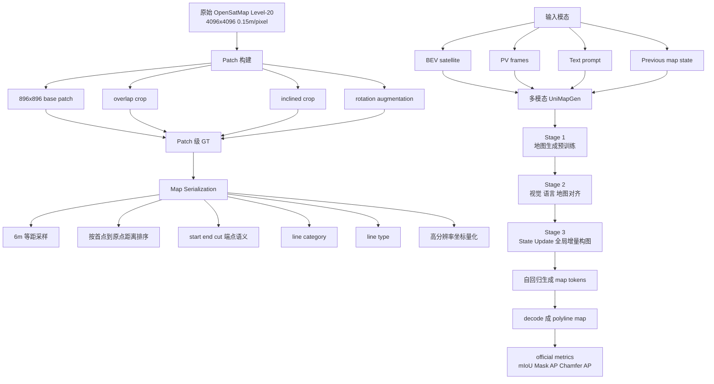
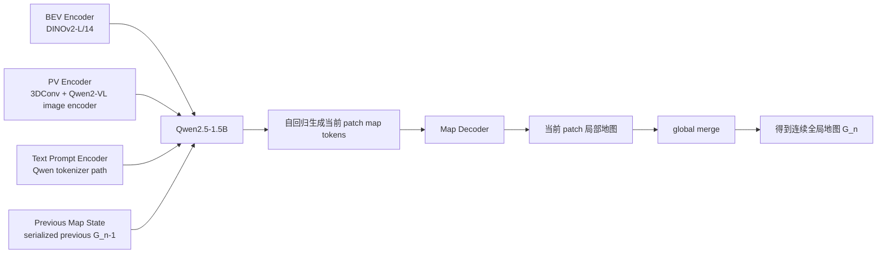
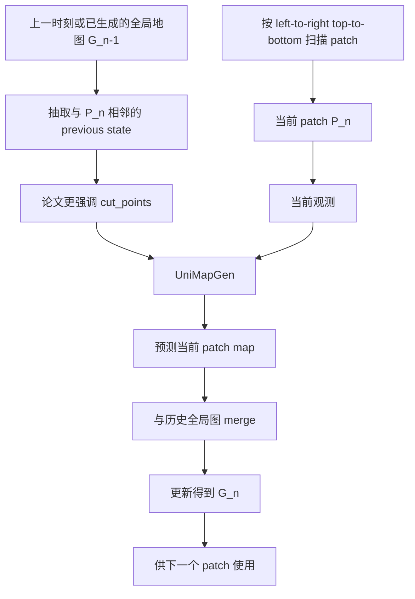
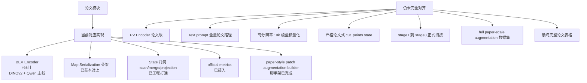
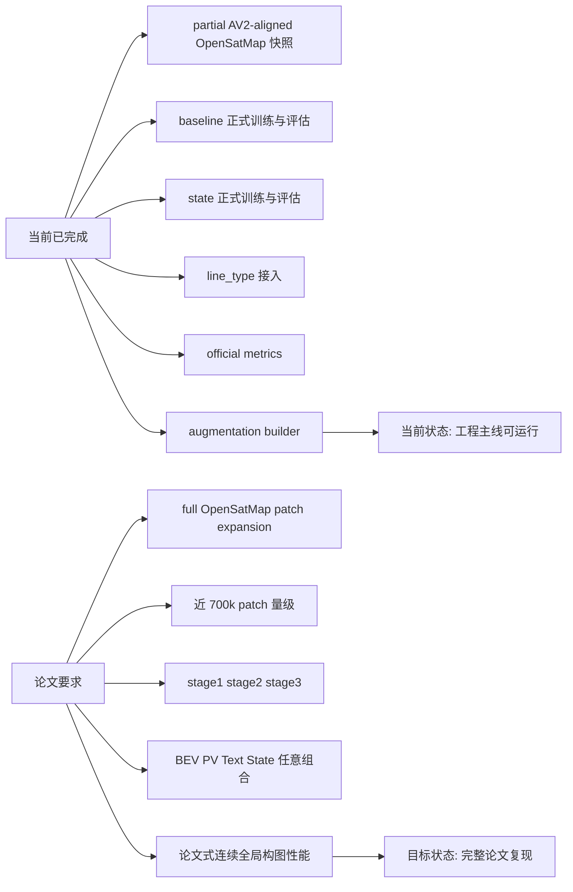
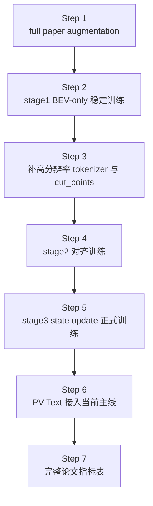
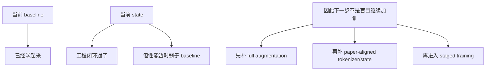

# UniMapGen 更贴论文版本流程图（2026-03-08）

这份图不是“当前已经完全实现的代码图”，而是“按论文理解整理出的目标流程图”，并把当前仓库已经对上的部分和仍未完成的缺口同时标出来。

适合回答两个问题：

- 论文里的完整方法链条是什么
- 我们当前代码已经走到哪一步，还缺哪一步

## 1. 论文目标总流程

## 2. 论文架构视角

## 3. 论文中的 state update 逻辑

## 4. 当前仓库对论文的对应关系

## 5. 当前代码与论文差距图

## 6. 推荐的论文对齐推进顺序

## 7. 当前最现实的理解

## 8. 和当前代码文档怎么配合看

建议配合下面三份文档一起看：

- [current_model_flowchart_20260308.md](/mnt/data/project/jn/UniMapGen/docs/current_model_flowchart_20260308.md)
- [agent_handoff_update_20260308.md](/mnt/data/project/jn/UniMapGen/docs/agent_handoff_update_20260308.md)
- [full_paper_reproduction_gap_analysis_20260307.md](/mnt/data/project/jn/UniMapGen/docs/full_paper_reproduction_gap_analysis_20260307.md)

如果只想快速理解：

1. 先看这份文档，理解论文目标链。
2. 再看 `current_model_flowchart_20260308.md`，理解当前实际跑通链。
3. 最后看 handoff 文档，确定下一步该做什么。
