# 序列化与 State Update 具体流程图（2026-03-08）

这份文档专门解释当前仓库里两条最关键的实现链：

- GT 是怎么被序列化成 map token 的
- previous state 是怎么从历史 patch 构出来，再喂给当前 patch 的

对应代码主要在：

- [serialization.py](/mnt/data/project/jn/UniMapGen/unimapgen/data/serialization.py)
- [qwen_map_dataset.py](/mnt/data/project/jn/UniMapGen/unimapgen/data/qwen_map_dataset.py)
- [state_geometry.py](/mnt/data/project/jn/UniMapGen/unimapgen/state_geometry.py)

## 1. GT 序列化总流程

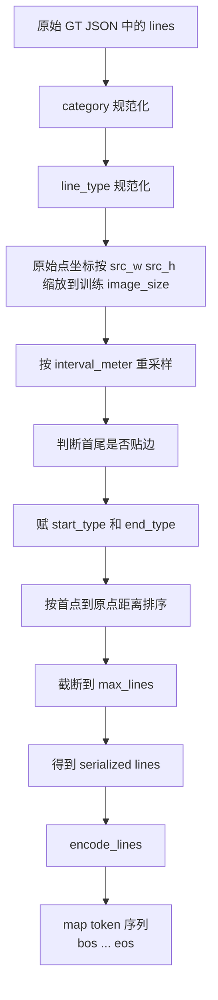

## 2. 单条 polyline 怎么变成 token

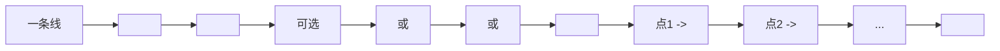

当前实现里的顺序就是：

1. `<line>`
2. `category token`
3. 可选 `line_type token`
4. `start_type token`
5. `end_type token`
6. `<pts>`
7. 一串 `<x_*> <y_*>`
8. `<eol>`

所有线外层再包：

1. `<bos>`
2. 多条 line 序列
3. `<eos>`

## 3. 当前序列化里每一步具体做什么

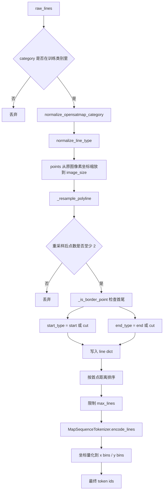

## 4. 数据集初始化时怎么准备 state

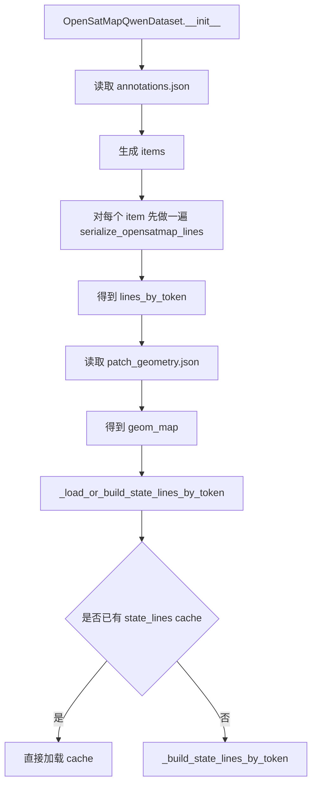

## 5. patch_scan 模式下的 state update 构建链

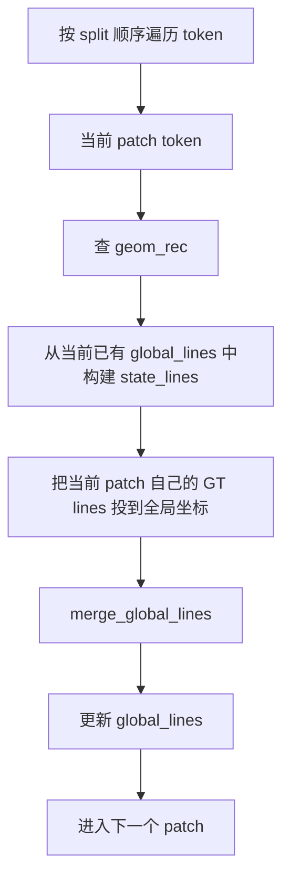

这里要注意：

- `state_lines` 来自“之前已经扫过 patch 的历史全局图”
- `global_lines` 的更新使用的是当前 patch 的 GT，而不是模型预测
- 所以训练侧的 previous state 是 teacher-forced 的几何历史

## 6. 从 global_lines 到当前 patch 的 state_lines

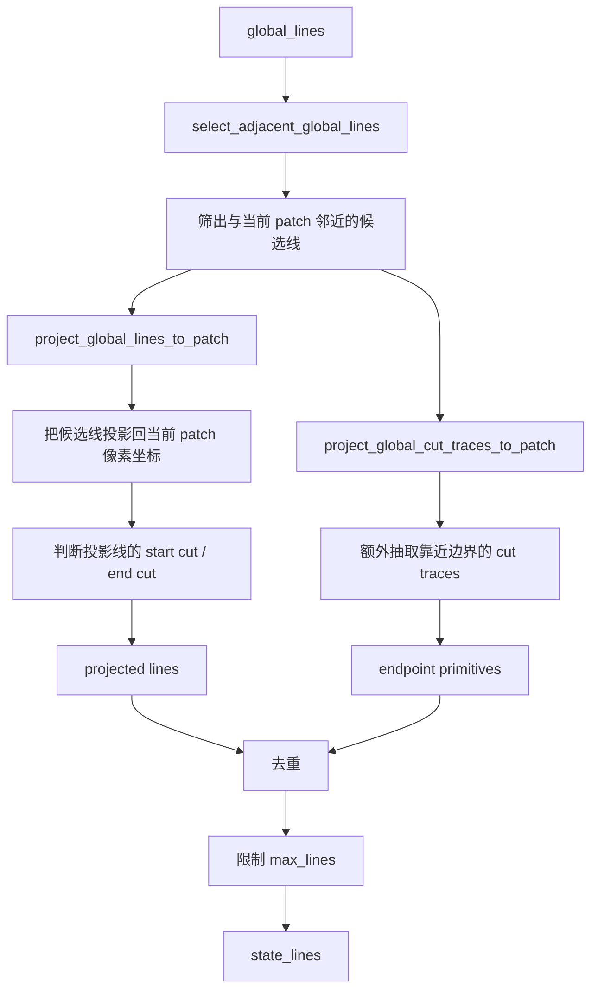

## 7. select_adjacent_global_lines 具体筛选逻辑

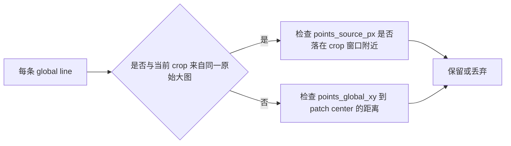

当前实现用了两种邻近性：

- source image 像素窗口邻近
- 全局米制坐标的中心距离邻近

## 8. 当前 patch GT 怎么并回 global_lines

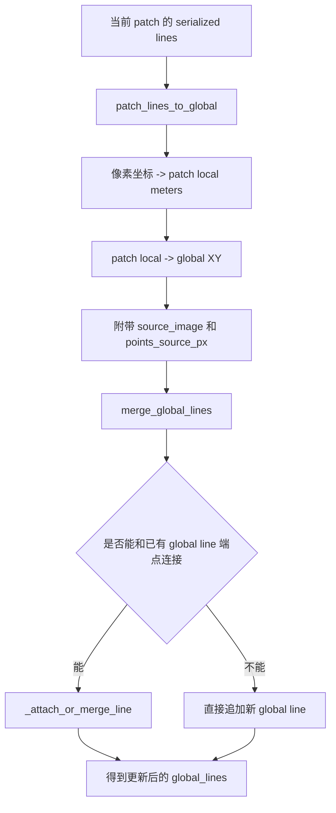

## 9. 当前 state prefix 怎么从 state_lines 变成 token

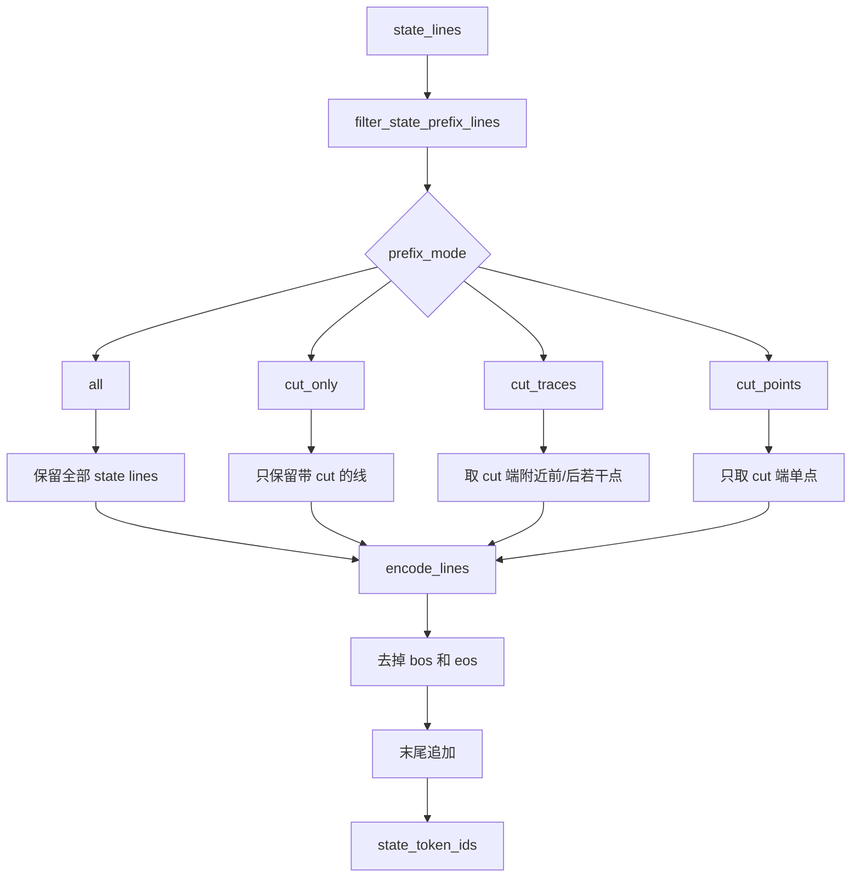

当前你常见的 `state` 配置默认更接近：

- `state_update_mode = patch_scan`
- `state_prefix_mode = cut_traces`

而更贴论文的方向是：

- `state_prefix_mode = cut_points`

## 10. 训练时单个样本最终长什么样

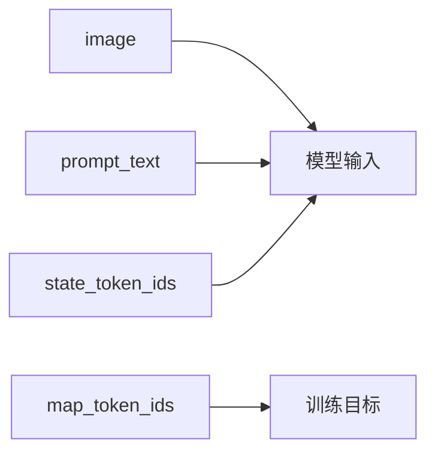

其中：

- `image` 是 resize 后的卫星图
- `prompt_text` 是文字模板
- `state_token_ids` 是 previous map prefix
- `map_token_ids` 是当前 patch GT 的目标 token 序列

## 11. 推理时和训练时最关键的差别

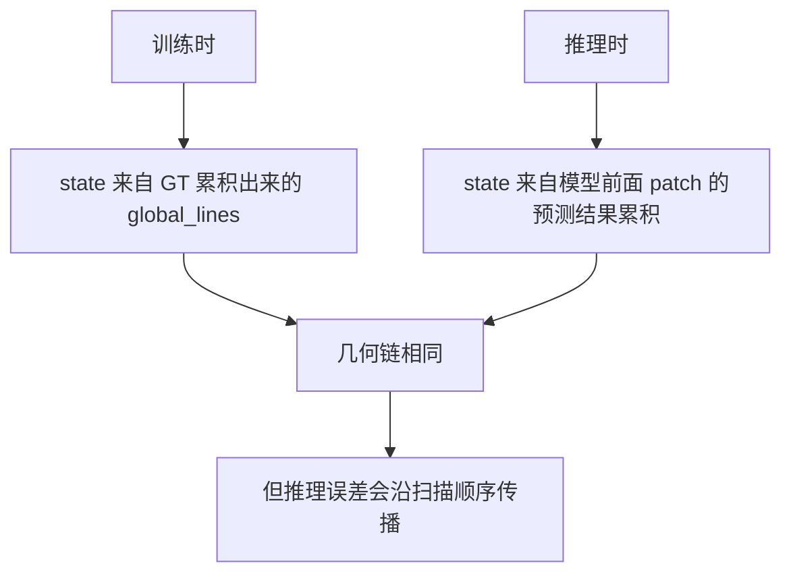

这也是当前现象里一个关键点：

- 训练 token-level 指标不算太差
- 但 state-scan official metrics 很弱

因为一旦进入推理闭环，错误会在 `patch_scan -> global merge -> next patch state` 中持续传播。

## 12. 一句话总结

可以把当前实现理解成：

1. 先把当前 patch GT 变成有 `category / line_type / start-end-cut / points` 的 token 序列。
2. 再把历史 patch GT 通过几何投影构成当前 patch 的 previous state。
3. 训练时让模型根据 `卫星图 + previous state + 文本 prompt` 生成当前 patch 的 map token。
4. 推理时把模型预测重新并回全局图，继续供后续 patch 使用。

相关文档：

- [current_model_flowchart_20260308.md](/mnt/data/project/jn/UniMapGen/docs/current_model_flowchart_20260308.md)
- [paper_aligned_model_flowchart_20260308.md](/mnt/data/project/jn/UniMapGen/docs/paper_aligned_model_flowchart_20260308.md)
- [agent_handoff_update_20260308.md](/mnt/data/project/jn/UniMapGen/docs/agent_handoff_update_20260308.md)
